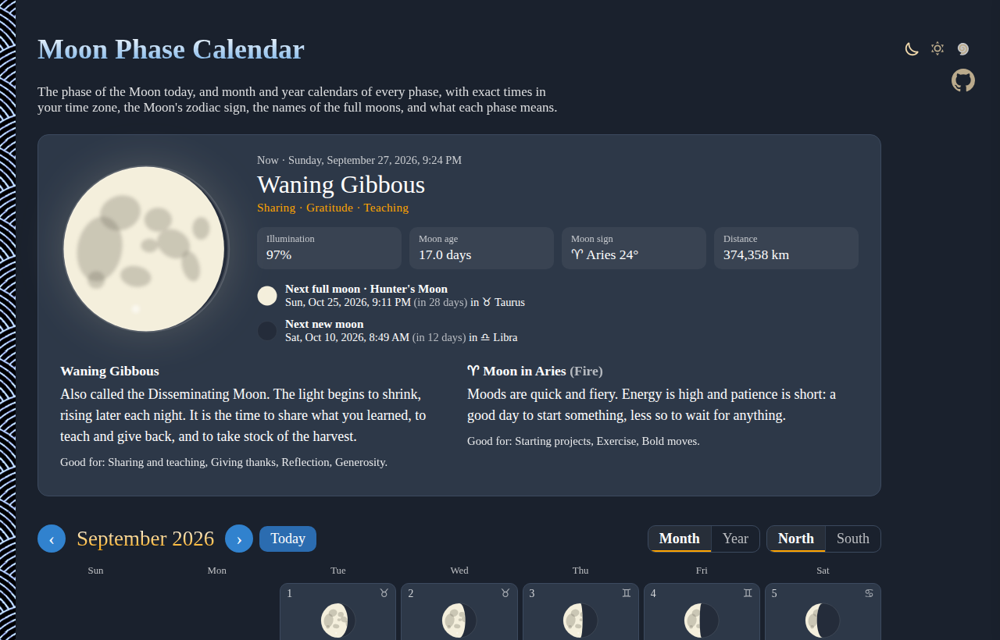
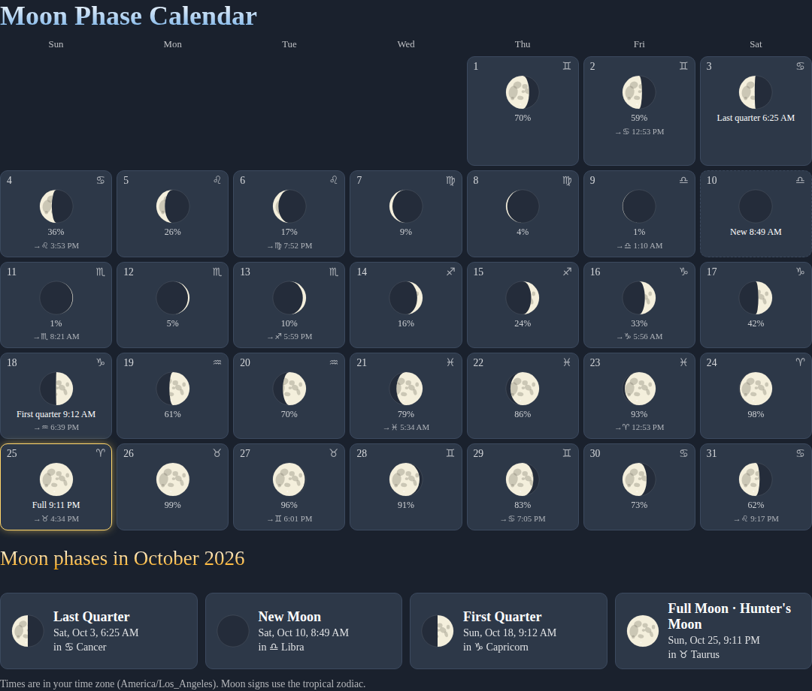
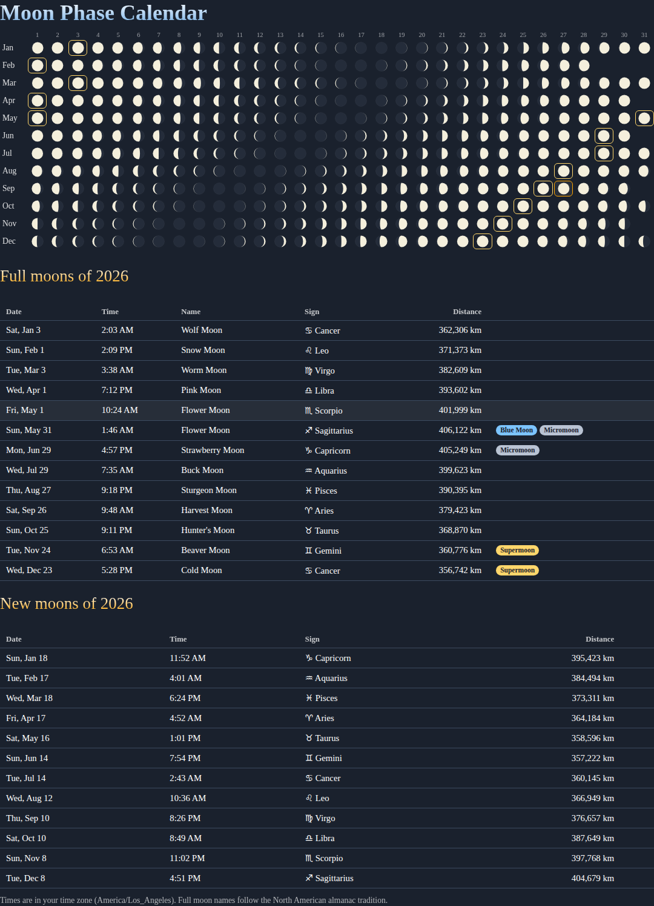

# Moon-Phase-Calendar

The phase of the Moon today, and month and year calendars of every phase, right in your browser. Exact times in your time zone, the Moon's zodiac sign, the names of the full moons, supermoons and blue moons, and what each phase means. No sign-up, no libraries, no images.

- [See the Moon Phase Calendar](https://evoluteur.github.io/moon-phase-calendar/)

## What it does

- **The Moon now**: its phase, illumination, age (days since the new moon), zodiac sign and degree, and distance from the Earth, with the dates of the next full and new moons.
- **Month calendar**: the Moon for every day, the exact time of each new moon, first quarter, full moon and last quarter, the Moon's sign each day and the time it moves into the next sign.
- **Year calendar**: the whole year of moons at a glance, and tables of the year's full moons (with their traditional names) and new moons.
- **Day details**: click any day for its phase, sign and what they mean, in a side panel.
- **Northern or Southern Hemisphere**: from the south the Moon looks upside down, lit on the left as it waxes. The North / South switch draws it your way.

Links are shareable: `#2026-10` opens October 2026, `#2026` the whole year. The arrow keys move to the previous and next month (or year).

## Phases, signs and names

- The **8 phases** (New Moon, Waxing Crescent, First Quarter, Waxing Gibbous, Full Moon, Waning Gibbous, Last Quarter, Waning Crescent), each with keywords, a meaning and what it is traditionally good for.
- The Moon in each of the **12 signs** of the tropical zodiac, with its element and mood.
- The traditional **full moon names** of the North American almanac tradition (Wolf, Snow, Worm, Pink, Flower, Strawberry, Buck, Sturgeon, Corn, Hunter's, Beaver and Cold), with the **Harvest Moon** set on the full moon closest to the September equinox and the **Hunter's Moon** on the next one.
- Tags for **Supermoons** (full moon closer than 361,000 km), **Micromoons** (farther than 405,000 km), **Blue Moons** (second full moon in a calendar month) and **Black Moons** (second new moon in a calendar month).

The meanings were written for this app, in the spirit of the lunar and astrological traditions.

## How it is calculated

Everything is computed in the browser, for any year from 1900 to 2100, in [js/astro.js](https://github.com/evoluteur/moon-phase-calendar/blob/main/js/astro.js):

- The positions of the Sun and the Moon come from Jean Meeus' *Astronomical Algorithms* (the Sun's low-precision formula and the 50 main periodic terms of the Moon's longitude and distance), with nutation and Delta T.
- The exact times of the phases and of the Moon's sign changes are solved from those positions with Newton's method, rather than looked up in a table.
- Checked against PyEphem for 2026, the phase times agree to about a minute.

## How it is built

Plain HTML, CSS and JavaScript, with no dependencies and no build step. Just open `index.html`.

- The moons are drawn as SVG: a dark disk, the lit part as a half circle plus an ellipse for the terminator, and a few soft maria.
- The phase and sign texts and the full moon names are in [js/moon-data.js](https://github.com/evoluteur/moon-phase-calendar/blob/main/js/moon-data.js).
- Three color themes (dark, light and blue) are shared with my other projects (copied from [omg-themes](https://github.com/evoluteur/omg-themes)). The theme and the hemisphere are remembered in the browser's local storage.

Moon-Phase-Calendar is open source at [GitHub](https://github.com/evoluteur/moon-phase-calendar) with MIT license.

Had fun browsing the app? [Buy me a coffee by becoming a sponsor](https://github.com/sponsors/evoluteur).

You may also be interested in my other projects [Mercury-Retrograde](https://github.com/evoluteur/mercury-retrograde) ([demo](https://evoluteur.github.io/mercury-retrograde/)), [Eclipse-Calendar](https://github.com/evoluteur/eclipse-calendar) ([demo](https://evoluteur.github.io/eclipse-calendar/)), and [Music-of-the-Spheres](https://github.com/evoluteur/music-of-the-spheres) ([demo](https://evoluteur.github.io/music-of-the-spheres/)). For more mystic arts as small web apps, see [Esoterica](https://evoluteur.github.io/esoterica.html).

Copyright (c) 2026 [Olivier Giulieri](https://evoluteur.github.io/).
